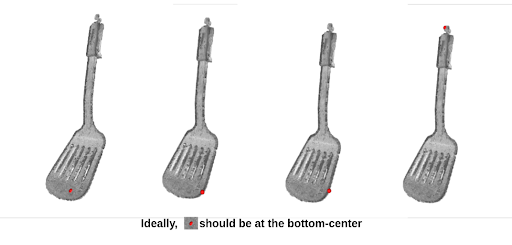

# contact_location_estimator




# Table of contents
* [General info](#general-info)
* [Technologies](#technologies)
* [How to use](#Codes)


# General info
Given a pointcloud in [m] scale and the wrench(contact force), find a single point that is most likely to be a contact location.

# Installation
```
git clone https://github.com/MMintLab/contact_location_estimator.git
```

# Dependencies
Project is created with:
Installation | Version
------------ | -------------
python | 3.7.0
numpy | 1.21.2
open3d | 0.13.0

# Dataset Preparation
Create a data folder in your directory 
```
$ mkdir pointcloud
$ mkdir wrench
```
Feel free to design the data directory according to your need. Again, the data files(.ply) are returned from the object frame containing mild calibration error.

Example: 
```
├── pointcloud
│   ├── task0
│   │   │── scan0.ply
│   │   │── scan1.ply
│   │   │── ...
│   ├── task1
│   │   │── scan0.ply
│   │   │── scan1.ply
│   │   │── ...

├── wrench
│   ├── task0
│   │   │── wrench.pickle: sequence of wrench corresponding to 'pointcloud/task1/scan0~N.ply'
│   ├── task1
│   │   │── wrench.pickle
```

# How to use

# Methods


